# Лабораторная работа №1. Эксплуатация MongoDB

## Часть 1. Базовая настройка

В первой части лабораторной работы требовалось развернуть MongoDB на виртуальной машине, настроить автоматический запуск сервиса, управление его состоянием и проверку доступности. Все действия выполнялись с помощью Ansible.

Сначала была проверена возможность подключения Ansible к серверу:
``` bash
ansible mongodb -m ansible.builtin.ping
```
В результате сервер успешно ответил `pong`.


Для подключения к виртуальной машине параметры сервера не указывались напрямую в `inventory`. Они передавались через переменные окружения и считывались Ansible с помощью `lookup('ansible.builtin.env', ...)`:

```yaml
ansible_host: "{{ lookup('ansible.builtin.env', 'SERVER_IP') }}"
ansible_user: "{{ lookup('ansible.builtin.env', 'SERVER_USER') }}"
ansible_ssh_private_key_file: "{{ lookup('ansible.builtin.env', 'SSH_KEY') | default('~/.ssh/id_ed25519', true) }}"
```

Таким образом, IP-адрес сервера, SSH-пользователь и путь к приватному ключу можно менять без редактирования самого inventory-файла. Если переменная `SSH_KEY` не задана, по умолчанию используется ключ `~/.ssh/id_ed25519`. Перед запуском Ansible достаточно экспортировать необходимые значения в окружение, например `SERVER_IP` и `SERVER_USER`.

Для установки MongoDB был создан playbook `install.yml`. Он подключает официальный репозиторий MongoDB, устанавливает необходимые пакеты, формирует `/etc/mongod.conf` из Jinja2-шаблона и запускает сервис `mongod`.

```bash
ansible-playbook playbooks/install.yml
```


MongoDB была настроена на порт `27017` и адрес `127.0.0.1`, поэтому на данном этапе база доступна только локально с виртуальной машины.

Автоматический запуск реализован через:

```yaml
ansible.builtin.systemd_service:
  name: mongod
  enabled: true
  state: started
```

Таким образом, MongoDB запускается автоматически после перезагрузки сервера.

Для управления сервисом был создан отдельный playbook `service.yml`. Одним playbook можно запустить, остановить или перезапустить MongoDB:

```bash
ansible-playbook playbooks/service.yml -e mongodb_service_state=stopped
ansible-playbook playbooks/service.yml -e mongodb_service_state=started
ansible-playbook playbooks/service.yml -e mongodb_service_state=restarted
```


Также был реализован отдельный health-check. Он подключается к MongoDB через `mongosh` и выполняет команду:

```javascript
db.adminCommand({ ping: 1 })
```

```bash
ansible-playbook playbooks/healthcheck.yml
```

При работающей MongoDB проверка завершается успешно:


Дополнительно я остановил MongoDB и повторно запустил health-check. В этом случае проверка корректно определила, что сервер недоступен.


## Часть 2. Управление ролевой моделью

Во второй части лабораторной работы требовалось настроить пользователей и собственные роли MongoDB, реализовать назначение и отзыв ролей, изменение набора разрешений, доступ только к отдельной коллекции, а также удаление пользователя и роли.

Для работы использовались две учебные базы:

```yaml
mongodb_university_db: "education"
mongodb_reports_db: "reports"
```

Также была включена авторизация MongoDB:

```yaml
security:
  authorization: enabled
```

Пароли пользователей не хранились в открытом виде в playbook. Для них использовался Ansible Vault:

```bash
ansible-vault edit group_vars/mongodb/vault.yml
```

Например, в зашифрованном файле хранятся пароли администратора и учебных пользователей.

Для работы модулей `community.mongodb` потребовался PyMongo версии 4+. Так как системный пакет Ubuntu 22.04 содержал более старую версию PyMongo, для Ansible было создано отдельное Python-окружение:

```yaml
mongodb_ansible_venv: "/opt/ansible-mongodb"
mongodb_ansible_python: "/opt/ansible-mongodb/bin/python"
```

Подготовка RBAC выполнялась отдельным playbook:

```bash
ansible-playbook playbooks/rbac_setup.yml --ask-vault-pass
```

Он устанавливает необходимые Python-зависимости, включает работу с PyMongo 4 и создает административного пользователя `lab_admin`.

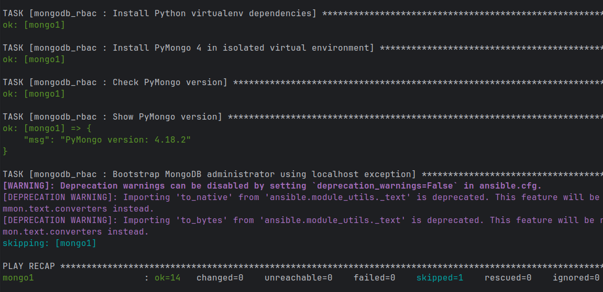

После этого для демонстрации всех операций второй части использовался отдельный playbook:

```bash
ansible-playbook playbooks/rbac_demo.yml --ask-vault-pass
```

В начале сценария создавались четыре собственные роли:

```text
educationReader
educationEditor
reportsReader
studentsReader
```

`educationReader` позволяет читать все коллекции базы `education`, а первоначальная версия `educationEditor` разрешает чтение и добавление документов. Роль `reportsReader` предназначена для чтения базы `reports`.

Отдельная роль `studentsReader` была создана для демонстрации ограничения доступа только одной коллекцией:

```yaml
privileges:
  - resource:
      db: "{{ mongodb_university_db }}"
      collection: "students"
    actions:
      - find
```

Таким образом, пользователь с этой ролью может читать `education.students`, но не получает права на остальные коллекции базы `education`.

Также были созданы пользователи:

```text
reader_user   → educationReader
editor_user   → educationEditor
students_user → studentsReader
```

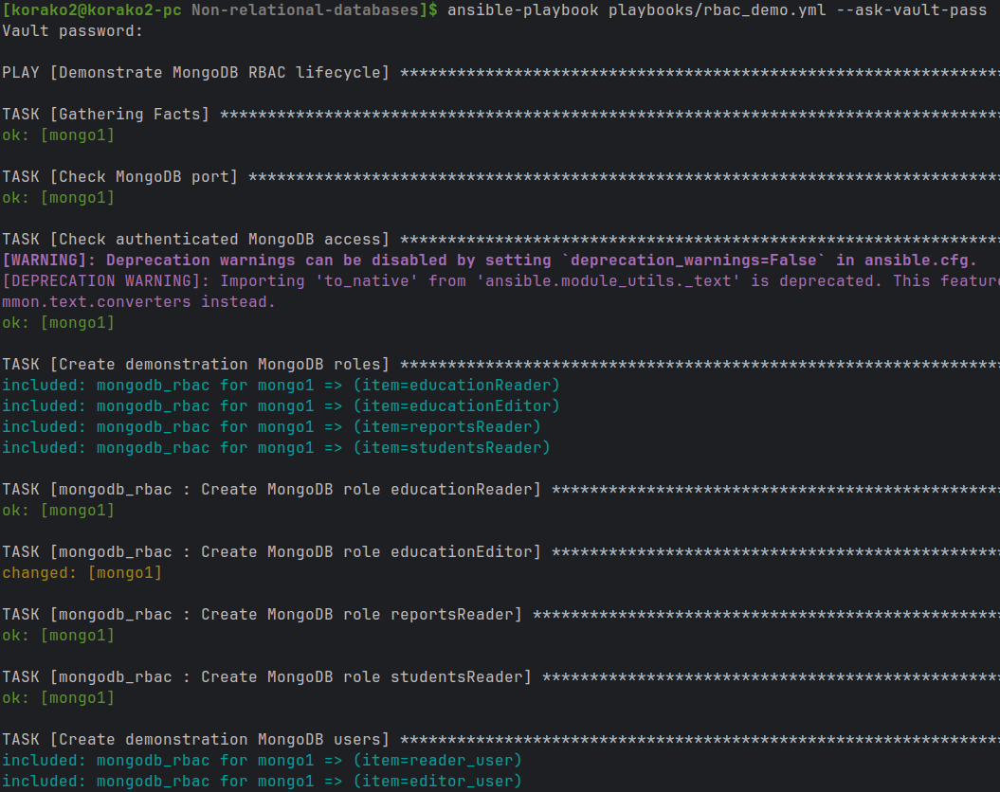
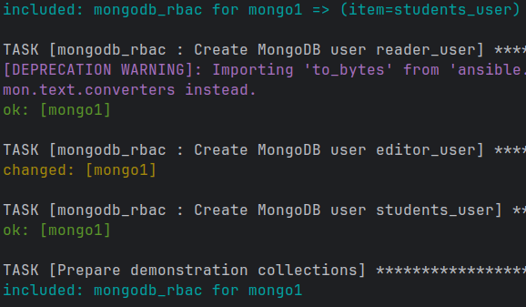

Для проверки ограничения по коллекции были подготовлены тестовые данные в коллекциях:

```text
education.students
education.teachers
education.courses
```

После этого playbook проверил доступ пользователя `students_user`.

Ожидаемый результат:

```text
students_user CAN read education.students
students_user CANNOT read education.teachers
```

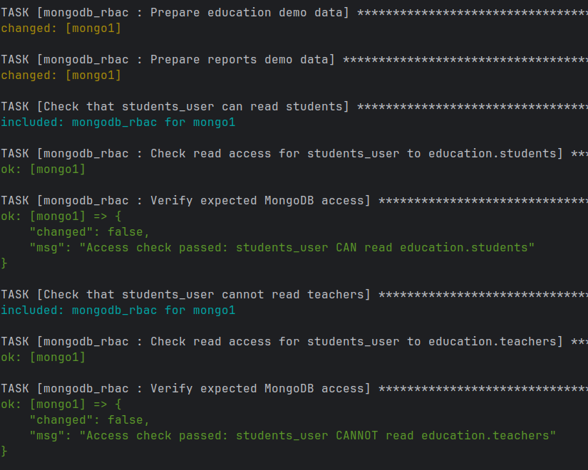

Далее была продемонстрирована выдача дополнительной роли. Пользователю `reader_user`, который изначально имел только `educationReader`, была дополнительно назначена роль `reportsReader`.

После назначения доступ к `reports.monthly_reports` успешно прошел проверку.

```text
reader_user
├── educationReader
└── reportsReader
```

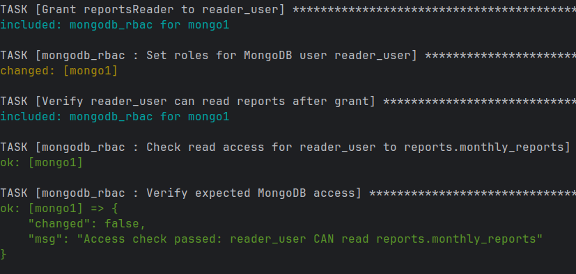

После этого набор разрешений роли `educationEditor` был изменен.

Изначально роль разрешала:

```text
find
insert
```

После изменения:

```text
find
insert
update
remove
```

Таким образом был выполнен пункт задания по изменению набора разрешенных операций уже существующей роли.

Далее роль `reportsReader` была отозвана у `reader_user`. После этого повторная проверка доступа к `reports.monthly_reports` завершилась ожидаемым отказом:

```text
reader_user CANNOT read reports.monthly_reports
```

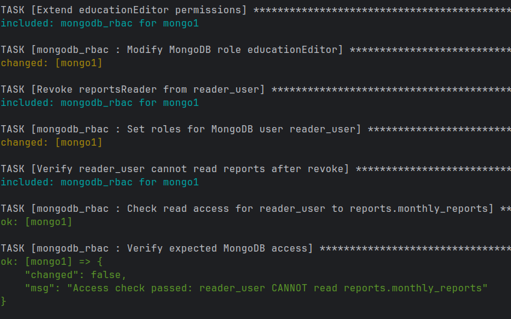

В конце демонстрационного сценария пользователь `editor_user` и роль `educationEditor` были удалены:

```text
Delete editor_user
Delete educationEditor
```

Playbook успешно завершил весь сценарий создания, изменения и удаления элементов ролевой модели.

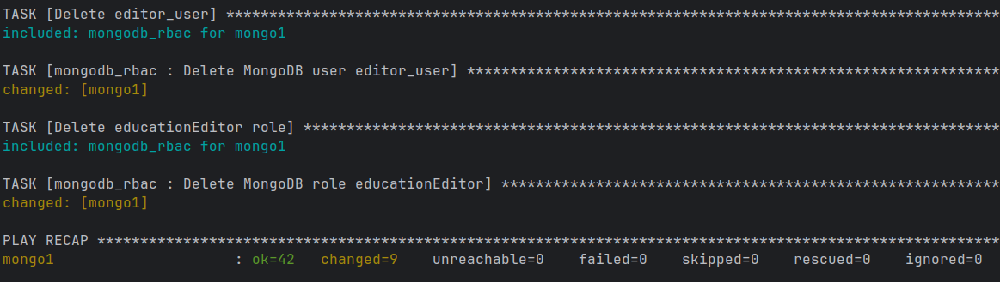

Таким образом, во второй части лабораторной работы были реализованы все требуемые операции с ролевой моделью MongoDB. При этом отдельные операции были вынесены в параметризованные Ansible task-файлы, поэтому одна и та же логика может использоваться для разных пользователей и ролей без копирования одинакового YAML-кода.

## Часть 3. Резервное копирование и восстановление

В третьей части лабораторной работы требовалось реализовать резервное копирование одной и всех учебных баз, хранение нескольких копий без перезаписи предыдущих, а также восстановление удаленной коллекции.

В качестве учебных баз используются уже созданные ранее:

```yaml
mongodb_lab_databases:
  - "{{ mongodb_university_db }}"
  - "{{ mongodb_reports_db }}"
```

То есть резервному копированию подлежат базы `education` и `reports`.

Для работы с резервными копиями была создана отдельная Ansible-роль `mongodb_backup`. В ней устанавливаются стандартные MongoDB Database Tools, содержащие утилиты `mongodump` и `mongorestore`.

Также создается отдельный технический пользователь:

```text
backup_user
├── backup
└── restore
```

Для него используются встроенные роли MongoDB `backup` и `restore`. Таким образом, резервное копирование не выполняется от административного пользователя `lab_admin`.

Пароль `backup_user`, как и остальные пароли в проекте, хранится в Ansible Vault. Для `mongodump` и `mongorestore` он передается через защищенный конфигурационный файл:

```text
/etc/mongodb-backup-tools.yml
```

Файл создается с правами `0600`, поэтому доступ к нему имеет только `root`.

Перед выполнением резервного копирования окружение подготавливается отдельным playbook:

```bash
ansible-playbook playbooks/backup_setup.yml --ask-vault-pass
```

Он устанавливает MongoDB Database Tools, создает `backup_user`, необходимые каталоги и проверяет доступность `mongodump`.

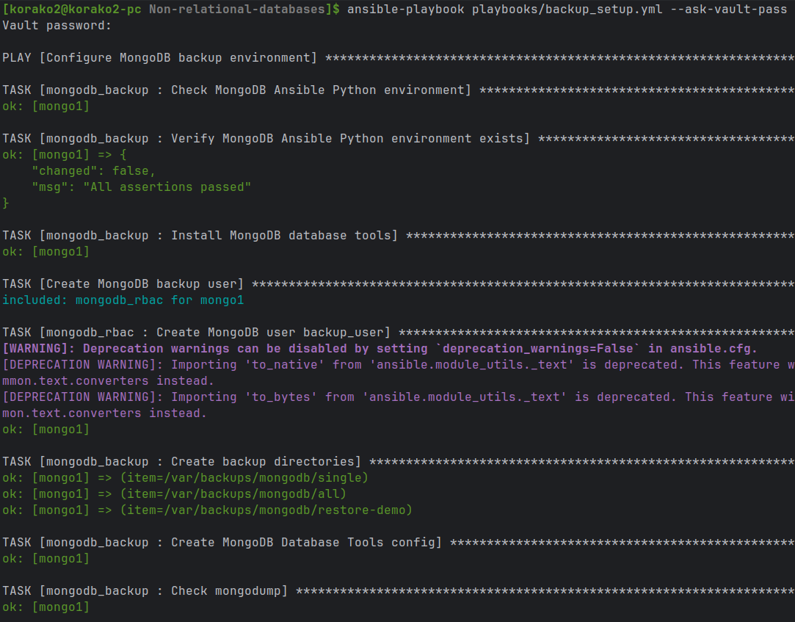

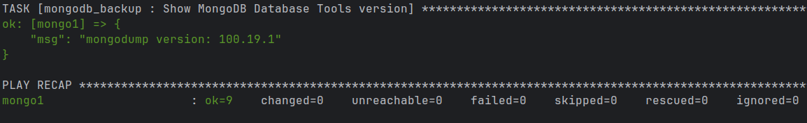

Резервные копии сохраняются в каталогах:

```text
/var/backups/mongodb/
├── single/
├── all/
└── restore-demo/
```

### Резервная копия одной базы

Для копирования одной учебной базы используется `backup_one.yml`:

```bash
ansible-playbook playbooks/backup_one.yml --ask-vault-pass
```

По умолчанию создается резервная копия базы `education`.

Внутри роли выполняется `mongodump` с использованием `--archive` и `--gzip`, поэтому результат сохраняется одним сжатым файлом.
После создания Ansible дополнительно проверяет существование файла и его ненулевой размер.

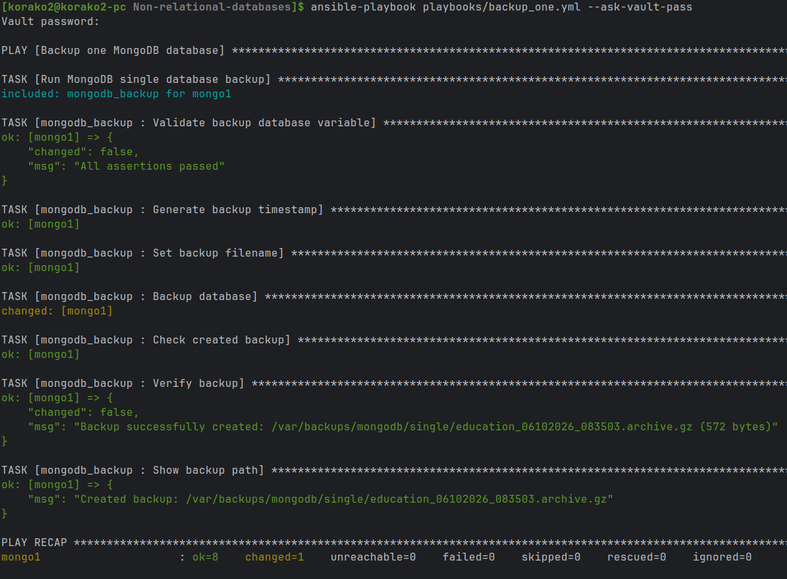

При необходимости тот же playbook можно использовать для другой учебной базы:

```bash
ansible-playbook playbooks/backup_one.yml \
  --ask-vault-pass \
  -e mongodb_backup_database=reports
```

То есть playbook не привязан жестко к одной базе.

### Хранение нескольких резервных копий

Чтобы новая копия не перезаписывала предыдущую, в имя каждого архива добавляется текущее время:

```yaml
mongodb_backup_file: >-
  {{ mongodb_backup_dir }}/{{ mongodb_backup_database }}_{{ mongodb_backup_timestamp_command.stdout }}.archive.gz
```

Таким образом, предыдущие резервные копии сохраняются.

Для проверки я несколько раз запустил `backup_one.yml`, после чего вывел содержимое каталога резервных копий.

```bash
ansible mongodb -b --ask-vault-pass \
  -m ansible.builtin.command \
  -a "ls -lh /var/backups/mongodb/single"
```

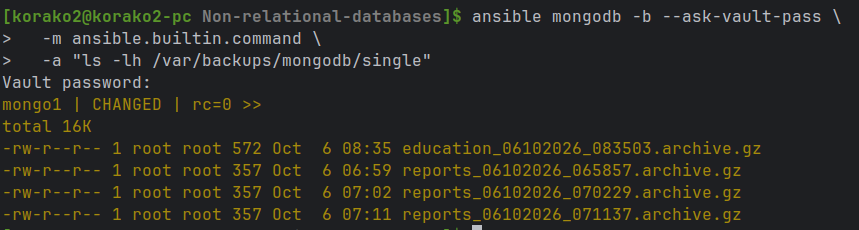

### Резервное копирование всех учебных баз

Для создания копий всех учебных баз используется:

```bash
ansible-playbook playbooks/backup_all.yml --ask-vault-pass
```

Playbook перебирает список:

```yaml
mongodb_lab_databases:
  - education
  - reports
```

и для каждой базы вызывает одну и ту же параметризованную задачу резервного копирования.

В результате в `/var/backups/mongodb/all` создаются архивы обеих баз:

```text
education_<timestamp>.archive.gz
reports_<timestamp>.archive.gz
```

Таким образом, для одной базы и для нескольких баз используется одна и та же логика `backup_one.yml`, а `backup_all.yml` только запускает ее в цикле.

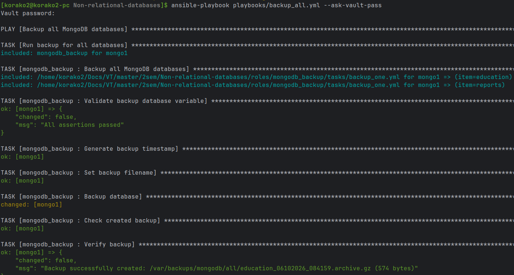

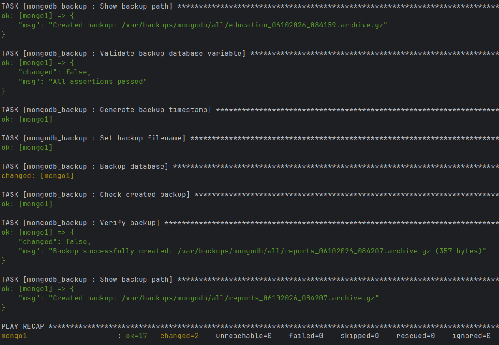

### Восстановление удаленной коллекции

Для демонстрации восстановления был создан отдельный playbook:

```bash
ansible-playbook playbooks/restore_demo.yml --ask-vault-pass
```

В качестве тестовой коллекции используется:

```text
education.students
```

Перед удалением в коллекцию добавляется специальный документ:

```text
_id: "restore-demo"
name: "Restore Demo Student"
course: 4
```

После этого создается резервная копия базы, а коллекция `students` удаляется командой `drop()`.

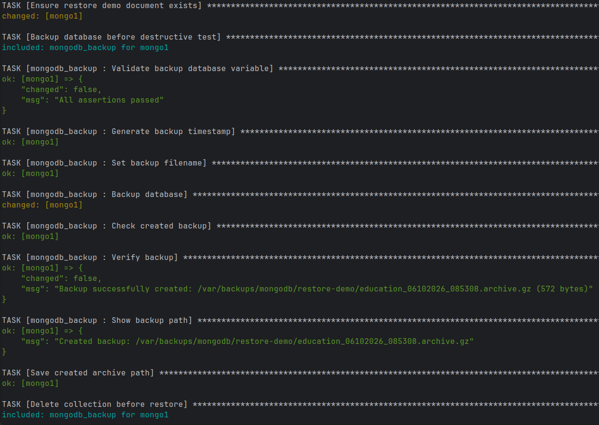
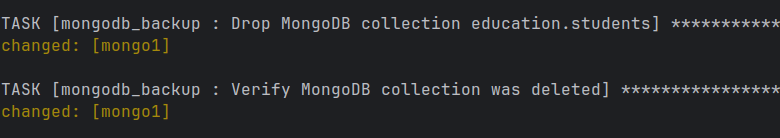

Для восстановления используется `mongorestore`. При этом восстанавливается не вся база `education`, а только необходимая коллекция:

```text
--nsInclude=education.students
```

После восстановления playbook проверяет сразу два условия:

- коллекция `students` снова существует;
- документ с `_id: "restore-demo"` снова присутствует.

При успешной проверке выводится сообщение:

```text
Collection education.students was successfully restored from ...
```

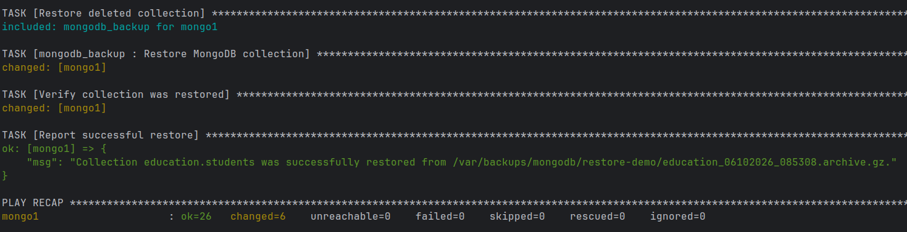

Таким образом, в третьей части были реализованы резервное копирование отдельной базы, копирование всех учебных баз, хранение нескольких независимых копий и восстановление конкретной удаленной коллекции. Все операции выполняются через Ansible, а общая логика резервного копирования вынесена в переиспользуемые task-файлы роли `mongodb_backup`.