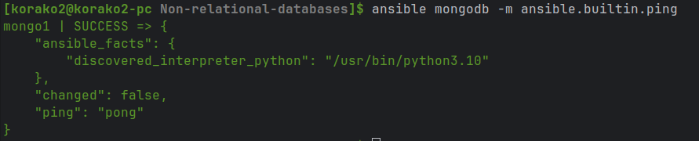
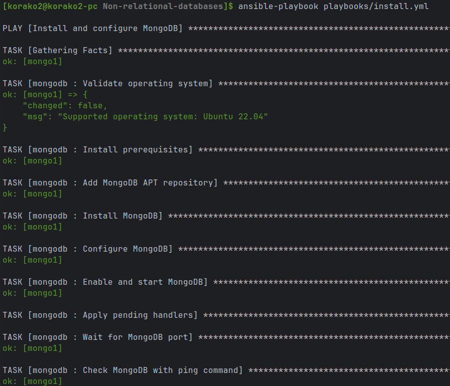
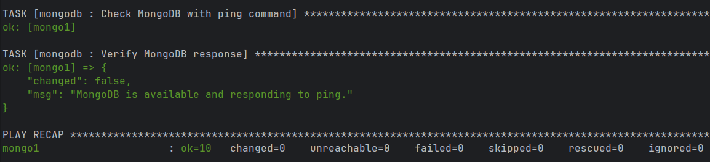
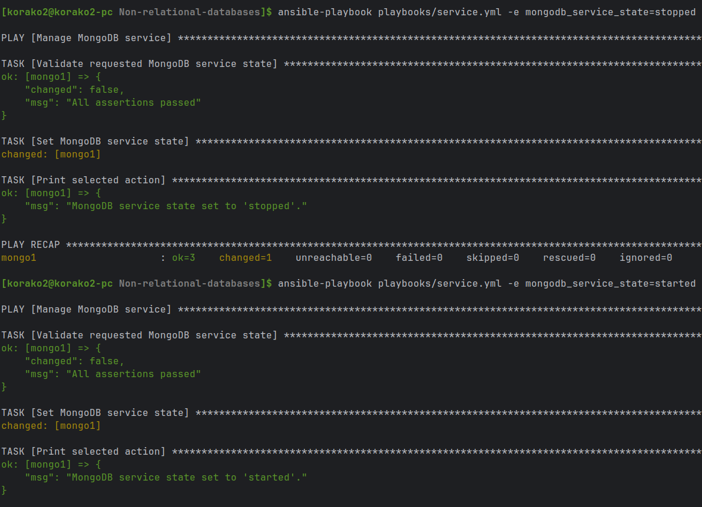
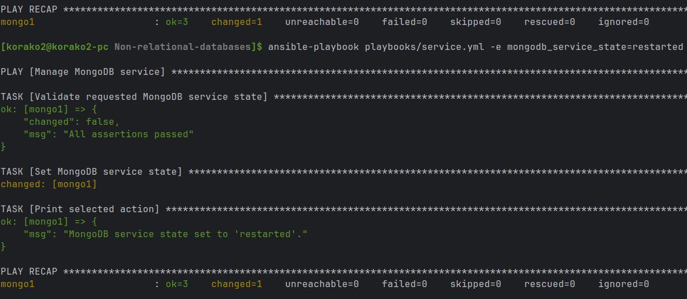
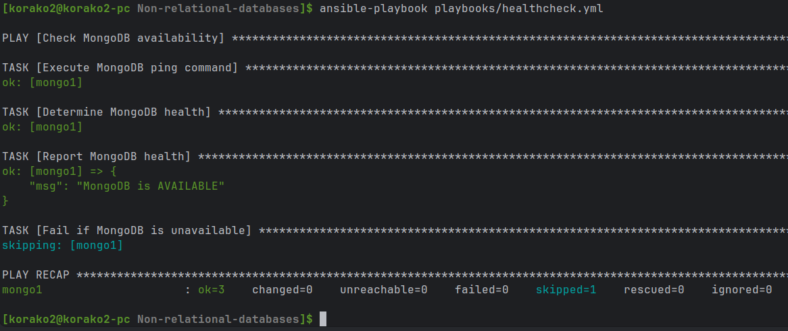
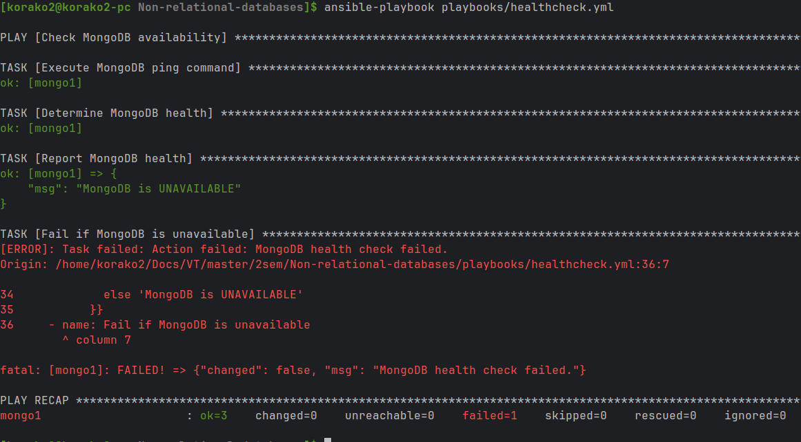

# Лабораторная работа №1. Эксплуатация MongoDB

## Часть 1. Базовая настройка

В первой части лабораторной работы требовалось развернуть MongoDB на виртуальной машине, настроить автоматический запуск сервиса, управление его состоянием и проверку доступности. Все действия выполнялись с помощью Ansible.

Сначала была проверена возможность подключения Ansible к серверу:
``` bash
ansible mongodb -m ansible.builtin.ping
```
В результате сервер успешно ответил `pong`.



Для подключения к виртуальной машине параметры сервера не указывались напрямую в `inventory`. Они передавались через переменные окружения и считывались Ansible с помощью `lookup('ansible.builtin.env', ...)`:

```yaml
ansible_host: "{{ lookup('ansible.builtin.env', 'SERVER_IP') }}"
ansible_user: "{{ lookup('ansible.builtin.env', 'SERVER_USER') }}"
ansible_ssh_private_key_file: "{{ lookup('ansible.builtin.env', 'SSH_KEY') | default('~/.ssh/id_ed25519', true) }}"
```

Таким образом, IP-адрес сервера, SSH-пользователь и путь к приватному ключу можно менять без редактирования самого inventory-файла. Если переменная `SSH_KEY` не задана, по умолчанию используется ключ `~/.ssh/id_ed25519`. Перед запуском Ansible достаточно экспортировать необходимые значения в окружение, например `SERVER_IP` и `SERVER_USER`.

Для установки MongoDB был создан playbook `install.yml`. Он подключает официальный репозиторий MongoDB, устанавливает необходимые пакеты, формирует `/etc/mongod.conf` из Jinja2-шаблона и запускает сервис `mongod`.

```bash
ansible-playbook playbooks/install.yml
```





MongoDB была настроена на порт `27017` и адрес `127.0.0.1`, поэтому на данном этапе база доступна только локально с виртуальной машины.

Автоматический запуск реализован через:

```yaml
ansible.builtin.systemd_service:
  name: mongod
  enabled: true
  state: started
```

Таким образом, MongoDB запускается автоматически после перезагрузки сервера.

Для управления сервисом был создан отдельный playbook `service.yml`. Одним playbook можно запустить, остановить или перезапустить MongoDB:

```bash
ansible-playbook playbooks/service.yml -e mongodb_service_state=stopped
ansible-playbook playbooks/service.yml -e mongodb_service_state=started
ansible-playbook playbooks/service.yml -e mongodb_service_state=restarted
```




Также был реализован отдельный health-check. Он подключается к MongoDB через `mongosh` и выполняет команду:

```javascript
db.adminCommand({ ping: 1 })
```

```bash
ansible-playbook playbooks/healthcheck.yml
```

При работающей MongoDB проверка завершается успешно:



Дополнительно я остановил MongoDB и повторно запустил health-check. В этом случае проверка корректно определила, что сервер недоступен.



